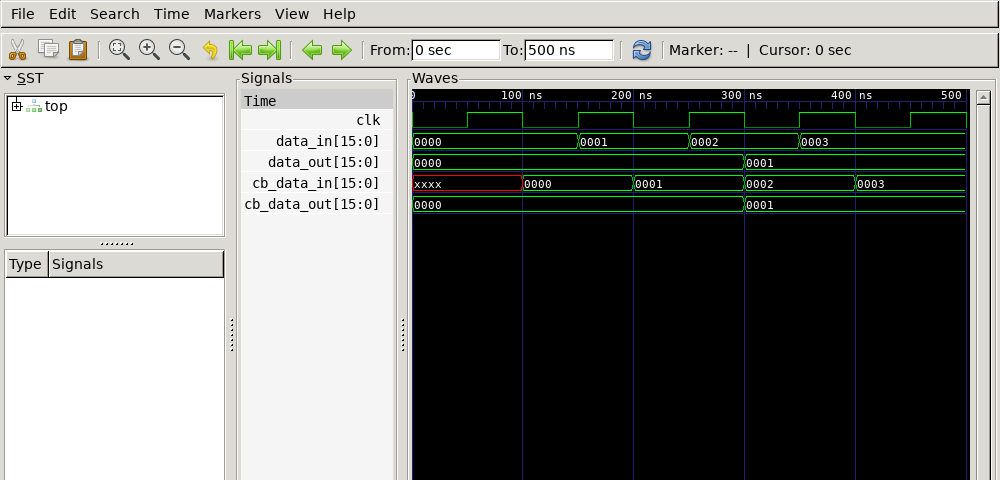
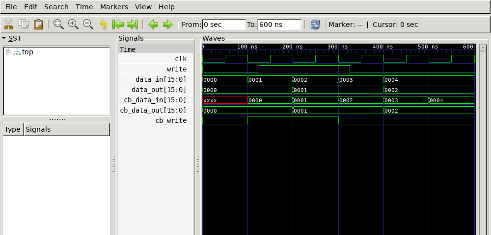

## 1. Спроектировать интерфейс и тестовое окружение для архитектуры ARM AHB. Роль инициализатора транзакций берет на себя bus master (verification IP), тестируемым компонентом выступает slave. В тестовом окружении требуется инстанцировать интерфейс, slave и master. Архитектура обязана генерировать ошибку по **отрицательному фронту сигнала HCLK**, если тип транзакции не равен IDLE или NONSEQ. Таблица сигналов (Table 4.2):
| Сигнал  | Ширина | Направление | Описание |
|---------|--------|-------------|----------|
| HCLK    | 1      | Output      | Такт |
| HADDR   | 21     | Output      | Адрес |
| HWRITE  | 1      | Output      | Флаг записи: 1=write, 0=read |
| HTRANS  | 2      | Output      | Тип транзакции: 2'b00=IDLE, 2'b10=NONSEQ |
| HWDATA  | 8      | Output      | Данные записи |
| HRDATA  | 8      | Input       | Данные чтения |

**Решение.**

```
interface ahb_if(input bit hclk);
  logic [20:0] haddr;
  logic        hwrite;
  logic [1:0]  htrans;
  logic [7:0]  hwdata;
  logic [7:0]  hrdata;

  localparam logic [1:0] IDLE   = 2'b00;
  localparam logic [1:0] NONSEQ = 2'b10;

  always @(negedge hclk)
    assert (htrans == IDLE || htrans == NONSEQ)
      else $error("@%0t: illegal HTRANS = 2'b%02b", $time, htrans);

  modport master (output haddr, hwrite, htrans, hwdata, input hrdata, hclk);
  modport slave  (input  haddr, hwrite, htrans, hwdata, hclk, output hrdata);
endinterface

module ahb_master(ahb_if.master m);
  initial begin
    m.htrans <= 2'b00; m.hwrite <= 0; m.haddr <= 0; m.hwdata <= 0;                        // IDLE
    @(posedge m.hclk); m.htrans <= 2'b10; m.haddr <= 21'h10; m.hwrite <= 1; m.hwdata <= 8'hA5; // NONSEQ write
    @(posedge m.hclk); m.htrans <= 2'b00;                                                  // IDLE
    @(posedge m.hclk); m.htrans <= 2'b10; m.haddr <= 21'h10; m.hwrite <= 0;                // NONSEQ read
    @(posedge m.hclk); m.htrans <= 2'b01;                                                  // ILLEGAL
    @(posedge m.hclk); m.htrans <= 2'b00;                                                  // IDLE
    @(posedge m.hclk);
    $finish;
  end
endmodule

module ahb_slave(ahb_if.slave m);
  always @(posedge m.hclk)
    if (m.htrans == 2'b10 && !m.hwrite) m.hrdata <= 8'h5A;
endmodule

module top;
  bit hclk = 0;
  always #5 hclk = ~hclk;
  ahb_if     bus(hclk);
  ahb_master mst(bus.master);
  ahb_slave  slv(bus.slave);
endmodule
```

Лог симуляции:
Verilator:  [40] %Error: Assertion failed: @40: illegal HTRANS = 2'b01 (not IDLE/NONSEQ)
XSim 2019.1: Error: @40000: illegal HTRANS = 2'b01 (not IDLE/NONSEQ)  Time: 40 ns

## 2. Модифицировать интерфейс: (a) внедрить блок синхронизации (clocking block), привязанный к отрицательному тактовому фронту и охватывающий весь пул I/O; (b) подготовить modport для тестбенча (master) и для проверяемого устройства (slave); (c) подключить созданный clocking block к списку интерфейсов master.

Исходный интерфейс:
```
interface my_if(input bit clk);
  bit        write;
  bit [15:0] data_in;
  bit [7:0]  address;
  logic [15:0] data_out;
endinterface
```

**Решение.**

```
interface my_if(input bit clk);
  bit          write;
  bit [15:0]   data_in;
  bit [7:0]    address;
  logic [15:0] data_out;

  // a. 
  clocking cb @(negedge clk);
    input  data_in;
    output write;
    output address;
    output data_out;
  endclocking

  // b + c.
  modport master (clocking cb);
  modport slave  (input write, address, data_out, output data_in);
endinterface
```

`data_in` - данные из DUT в TB (для мастера это `input`) `write/address/data_out` TB отдаёт в DUT (`output`). 

## 3. Структура из второго упражнения базируется на стандартных задержках (скью): чтение входов происходит за шаг #1step (непосредственно перед фронтом), а генерация выходов через #0 (строго в момент отрицательного фронта). Опорным триггером выступает negedge clk.
**Правила заполнения:**
- `cb.data_in` обновляется на каждом спаде, которое `data_in` держал прямо перед этим фронтом (`#1step`).
- `cb.data_out` при драйве TB появляется на raw `data_out` в тот же спад (`#0`) - формы `cb.data_out` и raw `data_out` совпадают.



## 4. (a) output skew 25ns для `write` и `address`; (b) input skew 15ns; (c) ограничить `data_in` изменением только по положительному фронту такта.

```
interface my_if(input bit clk);
  bit          write;
  bit [15:0]   data_in;
  bit [7:0]    address;
  logic [15:0] data_out;

  clocking cb @(negedge clk);
    output #25ns write, address;   // a. 
    output       data_out;
    input  posedge #15ns data_in;  // b + c
  endclocking

  modport master (clocking cb);
  modport slave  (input write, address, data_out, output data_in);
endinterface
```


## 5. заполнить диаграмму для clocking block из Ex4 (период 100ns)

Период 100ns posedge в t=0,100,200,300,400; negedge (опорное событие блока) в t=50,150,250,350,450.

**Диаграмма (временная):**

| Событие (нс)                | Действие                                                               |
| --------------------------- | ---------------------------------------------------------------------- |
| posedge 0,100,200,300,400   | `cb.data_in` ← raw `data_in` → 0, 1, 2, 3, 4                           |
| negedge 50,150,250,350,450  | опорный фронт; драйв `cb.data_out` появляется на raw `data_out` (`#0`) |
| negedge+25 = 75,175,275,375 | raw `write` и raw `address` обновляются (output `#25ns`)               |




Ключевые связи, видимые на диаграмме:
- `cb.write` меняется в момент спада (t=50, 250), raw `write` - на 25ns позже (t=75, 275): это и есть output skew 25ns.
- `cb.data_in` защёлкивается на фронте (t=0,100,200,300,400) → 0,1,2,3,4.
- `data_out` (output `#0`) меняется прямо на спаде (t=50→…), `cb.data_out` совпадает с ним.
